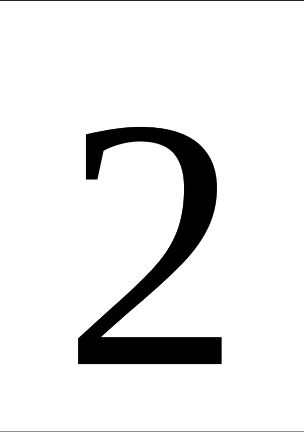
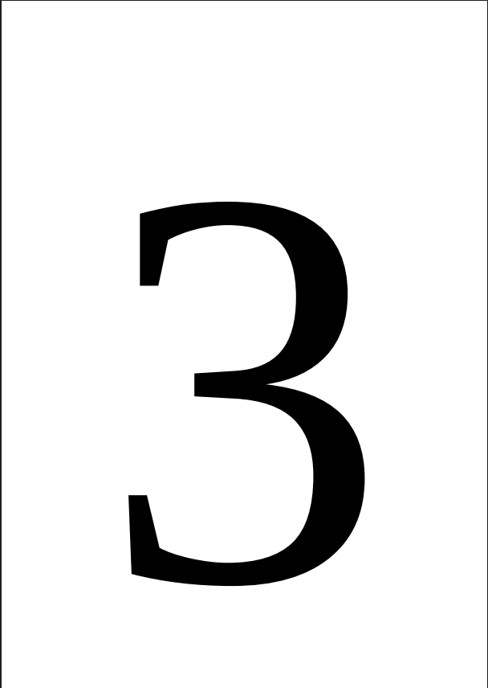
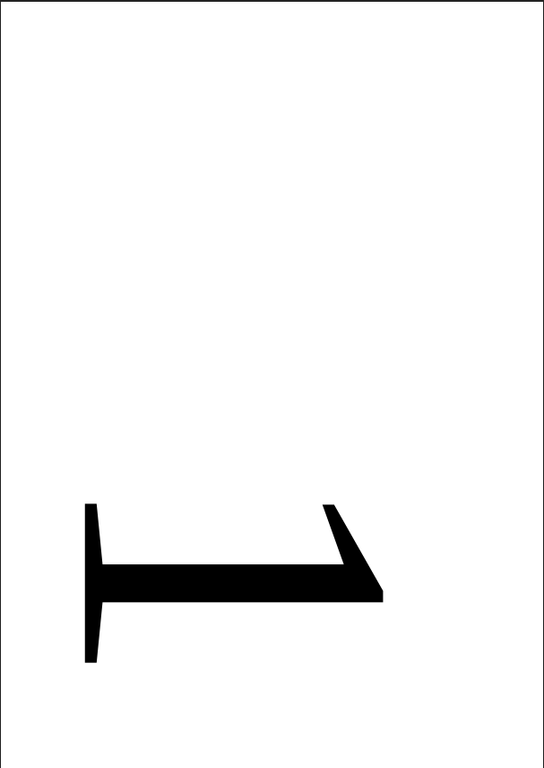
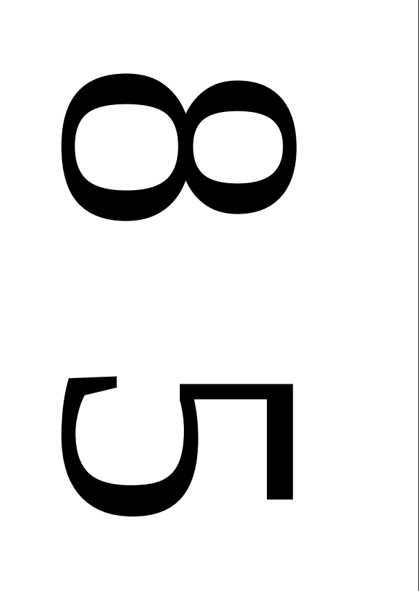
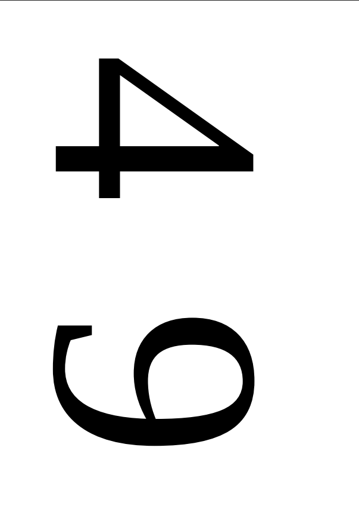
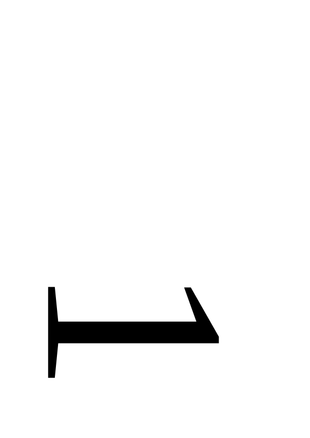
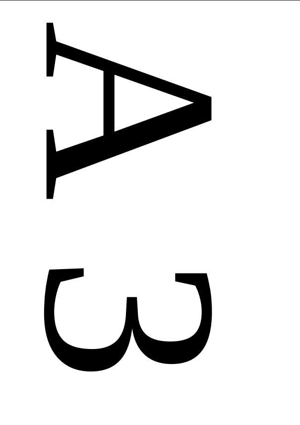
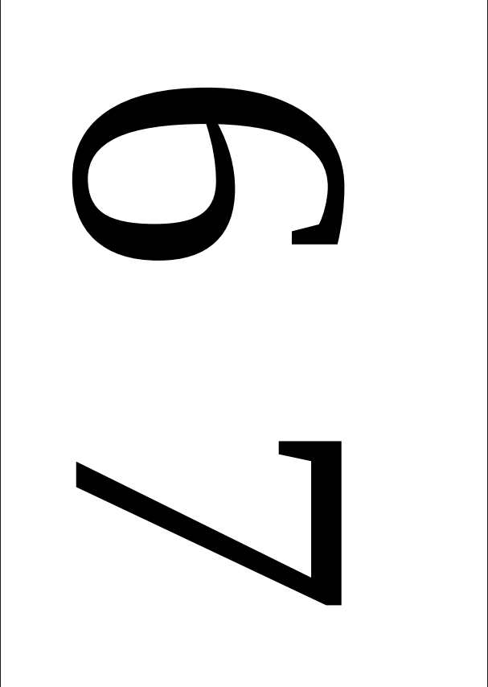

# BookletImposer V1.0.0

Tool for converting A4 PDFs into A5 booklet printing layout for simlex and duplex printers.

## Download 

Download the latest `.jar` file from:
[RELEASES](https://github.com/majchjan/BookletImposer/releases)

## Usage
```
java -jar -i <inputFile> [-o outputFile] [--isDuplexPrinter]
```

### Options
| Option | Description |
|--------|-------------|
| `-i --input <file>` | Input PDF [required] |
| `-o --output <file>` | Name of output file [optional] (if not used output file: 'inputfile + "_booklet.pdf"'|
| `--isDuplexPrinter` | Sets layout for Duplex Printer (File can be printed just by click print. To print booklet from layout for Simplex Printer you have to print first half of pages, then reverse printed sheets and print another half of pages.) |

## Build

To build the Maven project yourself, needed to use the following command in the project folder:
```
mvn package
```
JAR file appears in `target/`

## Exaple

If you have a PDF like:
| | | | | |
| - | - | - | - | - |
|  |  |  |  |  |
|  |  |  |  |  |

and use following command:

```
java -jar bookletimposer.jar -i document.pdf -o booklet.pdf
```

you get *booklet.pdf*:

| | | |
| - | - | - |
|  |  |  |
|  |  |  |

then you have to print 1-3 pages, reverse sheets and print 4-6 pages.

---

When you use following command:
```
java -jar bookletimposer.jar -i document.pdf -o booklet.pdf --isDuplexPrinter
```
you get *booklet.pdf*:

| | | |
| - | - | - |
|  |  |  |
|  |  |  |

and just print with duplex printer.